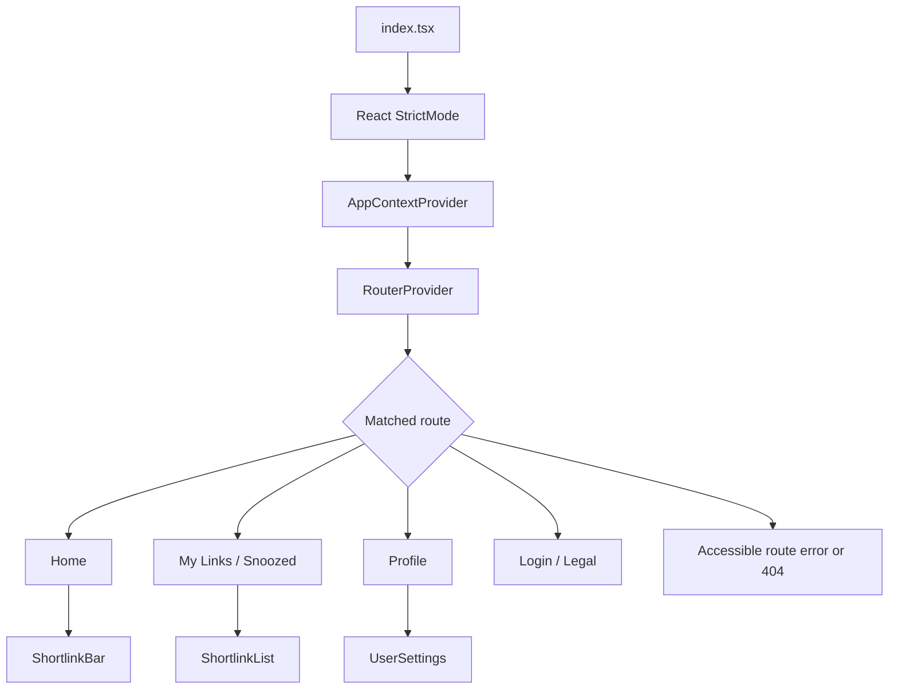

# React 19 Web Architecture

## Scope

`apps/web` now uses React 19 function components throughout. The rewrite preserves the existing routes, LESS layouts, GraphQL operations, web application behavior, and browser-extension behavior while replacing class lifecycle logic with reducers, custom hooks, derived render state, and cleanup-safe Effects.

## Architecture

- **Bootstrap and routing**
  - `StrictMode` wraps the application.
  - `AppContextProvider` owns `user`, `extension`, `requestUpdate()`, and global error presentation. See [Web error handling](./web-error-handling.md).
  - `useAppContext()` is required; using the context outside its provider throws immediately.
  - Pages use React Router hooks directly and authenticated pages return `<Navigate replace>` when no user is available.
  - Every route has an accessible error boundary, with a separate accessible 404 route.

- **Shared hooks**
  - `useMediaQuery()` uses `matchMedia` with `useSyncExternalStore`.
  - `useDebouncedValue()` owns and cleans up its timer.
  - `useAbortControllers()` aborts superseded requests by key and all outstanding requests on unmount.
  - Request sequence IDs provide an additional stale-response guard when a transport does not stop immediately after aborting.

- **Feature state**
  - `ShortlinkBar` delegates creation state to `useShortlinkCreator()` and `creatorReducer`.
  - `ShortlinkList` delegates loading, search, pagination, and immutable collection updates to `useShortlinkList()` and `shortlinkListReducer`.
  - `UserSettings` owns a controlled form with explicit dirty and pending state.
  - Values that can be calculated from current props or state—display URLs, CTA flags, grouping, empty states, and selection—are derived during render.

- **Interaction primitives**
  - Actions use native buttons; navigation uses route or external links.
  - Inputs report values through `onValueChange(value)`.
  - Radio groups use native radio semantics.
  - Menus support initial focus, arrow keys, Home/End, Escape, outside-pointer dismissal, and trigger focus restoration.
  - Snackbars use cleanup-safe timers and accessible `status` or `alert` announcements.

- **Data boundary**
  - Existing GraphQL names, variables, responses, and endpoints are unchanged.
  - UI-facing GraphQL methods accept an optional `AbortSignal`.
  - No server-state library or React Compiler was introduced.

## Application interaction order



The provider is initialized before route content renders. Feature components read context and router state directly instead of receiving injected `context`, `router`, or `extension` props.

## Shortlink creation and snooze flow

```mermaid
sequenceDiagram
    participant Page as Home
    participant Bar as ShortlinkBar
    participant Hook as useShortlinkCreator
    participant Cache as Shortlink cache
    participant API as GraphQL client
    participant History as Recent history

    Page->>Bar: Render with optional mobile callback
    Bar->>Bar: Choose active-tab URL before query parameter
    alt Valid query URL and no active tab
        Bar->>Hook: submitLocation(query snapshot)
    else User submits, pastes, or presses shortcut
        Bar->>Hook: submitLocation(explicit URL snapshot)
    end
    Hook->>Hook: Abort prior create; increment sequence
    Hook->>Cache: Check existing shortlink
    alt Cache hit
        Cache-->>Hook: Cached document
    else Cache miss
        Hook->>API: createShortlink(location, signal)
        API-->>Hook: Authoritative document
        Hook->>Cache: Store successful document
        Hook->>History: Refresh recent shortlinks
    end
    Hook-->>Bar: Return generated URL
    Bar->>Bar: Derive display URLs and CTA state
    opt Copy flow
        Bar->>Bar: Copy returned URL, not pending React state
    end
```

Descriptor edits are debounced in the feature hook. Each descriptor request is tied to the current location, hash, user tag, description, and request sequence; obsolete responses are discarded. Snoozing uses the same cancellation boundary, publishes success or error feedback, and preserves extension tab-close/sync behavior.

## Shortlink list flow

```mermaid
sequenceDiagram
    participant Route as Router location
    participant List as ShortlinkList
    participant Hook as useShortlinkList
    participant API as GraphQL client
    participant Menu as Action menu

    Route->>List: Path determines created or snoozed subsection
    List->>Hook: subsection + page limit
    Hook->>Hook: Debounce search and abort prior list request
    Hook->>API: Load replacement page with signal
    API-->>Hook: Current response
    Hook->>Hook: Replace immutable list and set hasMore
    List->>List: Derive cloned date-grouped rows
    opt Scroll toward end and hasMore
        List->>Hook: append()
        Hook->>API: Load next page with skip
        API-->>Hook: Append response
        Hook->>Hook: Append immutably; stop after short page
    end
    List->>Menu: Open action menu for stable document ID
    Menu-->>List: Edit, delete, or remove snooze
    List->>API: Mutation with signal
    API-->>List: Updated or deleted document
    List->>Hook: Immutable map or filter update
    List->>Menu: Close and restore trigger focus
```

Replacement and append loading are independent. Append requests cannot overlap, and late responses cannot overwrite newer route or search results. Errors are reported through app context and remain recoverable through Retry, while empty state is shown only after a completed successful load.

## Profile save flow

```mermaid
sequenceDiagram
    participant User as User
    participant Form as UserSettings
    participant API as GraphQL client
    participant Context as App context
    participant Notice as Snackbar

    User->>Form: Edit controlled user tag
    Form->>Form: Mark dirty and clear stale notice
    User->>Form: Submit native form
    Form->>Form: Guard duplicate submission; set pending
    Form->>API: updateLoggedInUser(value, signal)
    alt Success
        API-->>Form: Updated user
        Form->>Context: requestUpdate()
        Form->>Form: Save returned tag and clear dirty state
        Form->>Notice: Announce success
    else Failure
        API-->>Form: Error
        Form->>Form: Retain entered value
        Form->>Context: reportError(error)
        Context->>Notice: Announce recoverable error
    end
    Form->>Form: Clear pending in guarded finally
```

Unmounting aborts the save and invalidates its sequence so completion cannot update an obsolete form instance.

## Strict Mode and state rules

1. Effects are used only for external synchronization: subscriptions, requests, focus, media, timers, and browser APIs.
2. Every listener, observer, request, and timer has cleanup.
3. Reducers return new objects and arrays; server documents are never mutated.
4. Async handlers accept or capture explicit value snapshots instead of reading state immediately after dispatch.
5. Stable domain IDs are used for document selection, mutations, menus, and React keys.

## Verification

The rewrite is covered by Vitest and React Testing Library tests for reducers, immutable grouping, creation cache/network behavior, request races, descriptor staleness, query/extension initialization, shortcut copying, pagination, retry, profile saves, semantic controls, keyboard menus/radios, responsive subscriptions, timers, and cleanup.

Acceptance commands:

```sh
bun run --cwd apps/web typecheck
bun run --cwd apps/web lint
bun run --cwd apps/web test
bun run --cwd apps/web build:web
bun run --cwd apps/web build:extension
```
