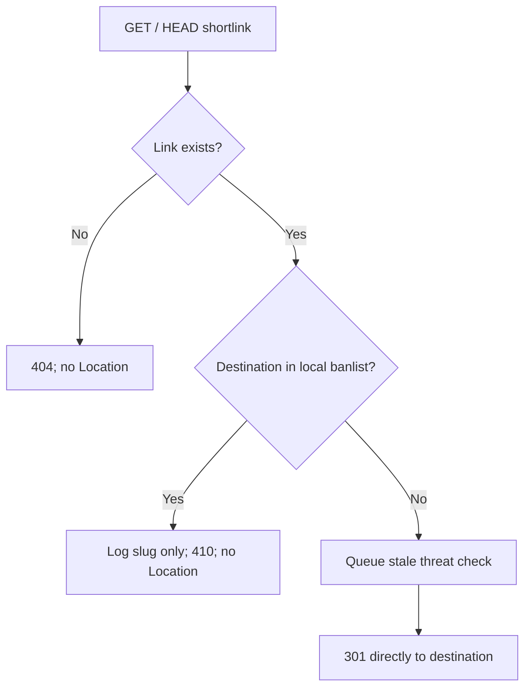
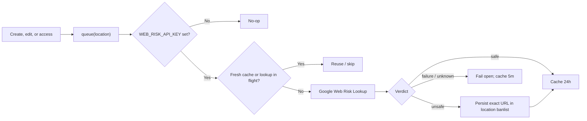

# Redirect and abuse screening

## HTTP contract

```text
GET or HEAD /:shortlink
├─ unknown ────────────────> 404 + X-Robots-Tag: noindex
├─ destination banlisted ─> 410 + X-Robots-Tag: noindex
└─ active ─────────────────> 301 + Location: <destination>
                              Cache-Control: no-store
                              X-Robots-Tag: noindex
                              Referrer-Policy: no-referrer
```

- Hash and descriptive links use the same controller and headers.
- Browsers, search crawlers, and preview crawlers receive identical responses.
- Redirects contain one direct `Location` hop and no response body.
- `robots.txt` permits crawling so bots can observe the redirect and `noindex`.
- `no-store` preserves destination editing but cannot control third-party preview caches.

## Request flow



Threat checks never delay the redirect. A newly submitted malicious URL may work
until its asynchronous verdict is persisted.

## Threat-screening flow



Requested threat types:

```text
MALWARE | SOCIAL_ENGINEERING | UNWANTED_SOFTWARE
```

Only hostnames, verdict details, and shortlink slugs are logged. Destination query
strings and the Web Risk API key are excluded from application logs.

## URL admission

```text
accepted: public http:// or https:// URLs

rejected
├─ other protocols
├─ embedded username/password
├─ localhost and *.localhost
├─ private, loopback, link-local, reserved, or mapped IP literals
└─ configured SHLK service hosts, including trailing-dot forms
```

Checks run on creation and destination edits before persistence. Existing banlist
entries continue to reject creation/editing; redirect-time checks convert them to
`410 Gone`.

## Implementation map

| Concern | Location |
| --- | --- |
| Redirect status, headers, `404`/`410` | `apps/api/src/libs/app.controllers.ts` |
| URL normalization and admission | `apps/api/src/libs/url-policy.ts` |
| Async lookup, TTLs, deduplication | `apps/api/src/libs/threat-check.service.ts` |
| Banlist matching and unsafe persistence | `apps/api/src/libs/ban.queries.ts` |
| Create/edit/access scheduling | `apps/api/src/libs/shortlink.queries.ts` |
| Crawler access | `apps/web/public/robots.txt` |
| Optional secret | `WEB_RISK_API_KEY` in config and Compose |

No database migration or GraphQL change is required. Unsafe destinations reuse the
existing `location` banlist.

## Operational boundary

```text
301 canonicalization reduces short-URL indexing
                    ≠
domain reputation isolation from malicious redirect chains
```

If reputation isolation becomes mandatory, serve public redirects from a separate
registrable domain via `PUBLIC_SERVICE_URL`.
