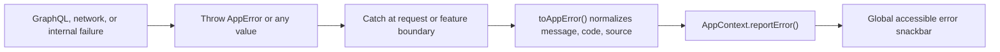
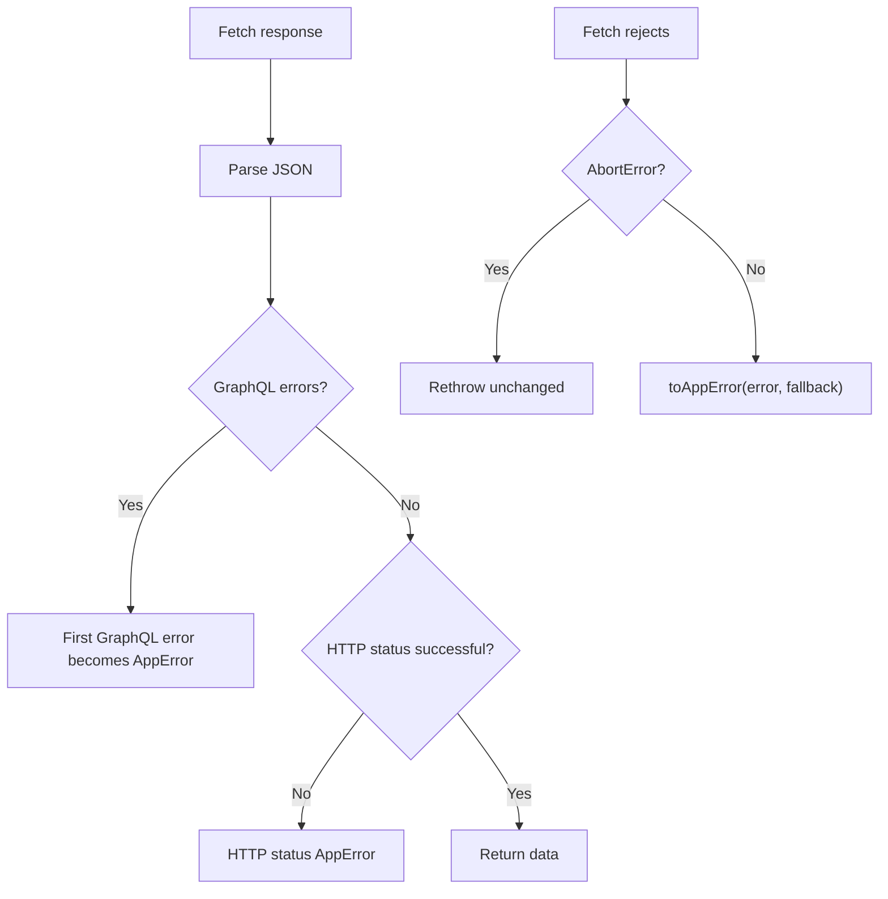

# Web error handling

## Flow



The shared error shape is in `apps/web/src/js/app-error.ts`:

```ts
new AppError('URL is invalid', {
  code: 'INVALID_URL',
  source: originalValue
})
```

- `message`: safe text shown to the user.
- `code`: optional stable identifier for program logic or diagnostics.
- `source`: optional original error or payload; never rendered directly.

`toAppError()` accepts `AppError`, native `Error`, GraphQL-shaped objects or arrays,
strings, and arbitrary thrown values. Unknown values receive a safe fallback message.

## Where errors are caught

### Requests

`request-wrapper.gql.ts` normalizes GraphQL, HTTP, parse, and transport failures:



Callers therefore receive an `AppError` whether the server returned HTTP success
with `errors`, an HTTP failure with or without GraphQL errors, an invalid JSON
response, or a transport failure. Cancellation remains an unchanged `AbortError`.

### Features

Async feature handlers use `try/catch`. Non-abort failures go to app context:

```ts
const { reportError } = useAppContext()

try {
  await performAction()
} catch (error) {
  if (!isAbortError(error)) {
    reportError(error, { fallbackMessage: 'Could not save this link' })
  }
}
```

Put synchronous validation inside the same `try`. Otherwise a throw can escape the
event handler before `reportError()` runs.

Abort errors are expected cancellation and must not show a snackbar. Existing
request sequence checks should also remain, so stale requests cannot publish errors.

### Startup

Extension errors raised during its blocking bootstrap are passed to
`AppContextProvider` as `initError` and displayed after mounting. The web app
mounts first; a non-abort initialization failure settles authentication as
anonymous and creates the same global error notice inside the provider. See
[Web loading process](./web-loading-process.md).

## Showing a new error correctly

1. Throw `AppError` when creating a domain error; preserve the cause in `source`.
2. Catch at the nearest feature boundary that can decide whether the failure is
   current, cancelled, or recoverable.
3. Call `reportError()`. Do not create another feature-owned error snackbar.
4. Keep local state only for UI state such as `loading`, an inline error style, or a
   success notice.

Basic reporting:

```ts
reportError(error, { fallbackMessage: 'Could not update your profile' })
```

`fallbackMessage` is used only when the caught value has no usable message; it does
not replace a specific GraphQL or `AppError` message.

Recoverable reporting:

```ts
reportError(error, {
  fallbackMessage: 'Could not load your links',
  action: { label: 'Retry', onClick: reload },
  onDismiss: clearLocalError
})
```

The provider owns snackbar dismissal. An action dismisses the current error before
running its callback. `onDismiss` can synchronize remaining local error state.

## Adding error types

Prefer a new stable `code` over a new class:

```ts
throw new AppError('This shortlink already exists', {
  code: 'SHORTLINK_CONFLICT',
  source: response
})
```

Add an `AppError` subclass only when callers need extra typed fields or distinct
behavior. The subclass must extend `AppError`, so `toAppError()` preserves it:

```ts
class ValidationError extends AppError {
  constructor(message: string, readonly field: string, source?: unknown) {
    super(message, { code: 'VALIDATION_ERROR', source })
  }
}
```

If an external source introduces a new error shape, extend `toAppError()` once rather
than parsing it in individual components. Keep `message`, `code`, and `source`
semantics unchanged and add normalization tests in `apps/web/test/app-error.test.ts`.

## Checklist

- Is the user-visible message safe and useful?
- Is validation inside a caught region?
- Are abort and stale-request errors ignored?
- Does the failure call `reportError()` exactly once?
- Is retry cleanup supplied through `action` or `onDismiss`?
- Does a new external shape have a normalization test?
