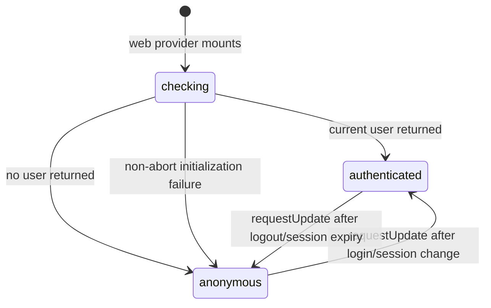
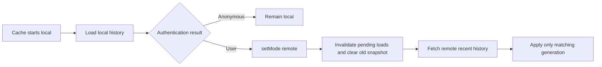
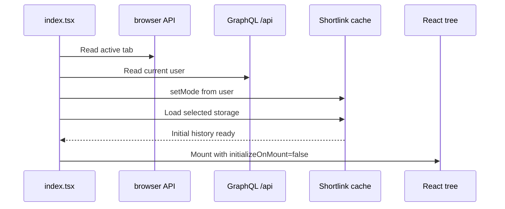

# Web loading process

## Purpose

This is the dependency map for changing startup without delaying the homepage,
redirecting before authentication is known, or allowing stale cache data to win.
It covers both the web app and extension because their bootstrap order is
intentionally different.

## Web app: first request to settled state

```mermaid
sequenceDiagram
    participant HTML as index.html
    participant Entry as index.tsx
    participant React as React tree
    participant Context as AppContextProvider
    participant Cache as Shortlink cache
    participant API as GraphQL /api

    HTML->>HTML: Paint static loading shell
    HTML->>HTML: Preload WOFF2 and poster; request external CSS and entry JS
    Entry->>React: Mount immediately
    React->>Context: initializeOnMount=true, authStatus=checking
    React->>React: Render eager Home; lazy routes use shared Suspense shell
    Context->>API: getInitAppContext(signal)
    Cache->>Cache: Load local recent history
    API-->>Context: User or anonymous result
    Context->>Cache: setMode(remote when user, otherwise local)
    Context->>React: Set user and final authStatus
    React->>Cache: Refresh history after user identity changes
    Cache-->>React: Apply only the newest generation
```

The critical rule is that the web entry does not await authentication or cache
I/O before `createRoot().render()`. The homepage is usable while
`authStatus === 'checking'`; authentication only refines account UI and data.

### Initial document dependencies

```text
index.html
├─ external entry CSS (render-blocking)
├─ Mori SemiBold WOFF2 preload (font-display: swap)
├─ hashed WebP poster preload (high priority, initial LCP resource)
└─ entry JS
   ├─ Home and route error boundary (eager)
   └─ login/app/profile/legal chunks (requested only by their routes)
```

Do not make the poster dependent on React mounting: its preload is what removes
the former LCP discovery delay. Do not import authenticated or legal pages from
an eager module, or their JS and CSS will return to the homepage entry chunk.

## Authentication state machine



- `checking`: account controls are placeholders and must not be interactive.
- `anonymous`: sign-in controls are enabled; protected routes redirect.
- `authenticated`: account controls and remote history are enabled.
- An initialization failure is nonblocking: settle as anonymous and report the
  existing global error snackbar.
- Every on-mount initialization owns an `AbortController` and sequence number.
  Cleanup aborts the request and invalidates the sequence, which makes React
  Strict Mode's mount/effect replay safe.

Protected pages must test readiness before absence:

```tsx
if (context.authStatus === 'checking') return <LoadingSkeleton />
if (!context.user?.email) return <Navigate to="/login" replace />
```

Reversing these conditions causes a direct protected-route visit to redirect
while the user request is still pending.

## Cache transition and homepage input



`Cache.setMode()` is the only supported way to change cache source. It clears
the snapshot and increments `storageGeneration`; `setStorage()` captures a new
generation and applies its result only if it is still current. Never mutate the
mode or storage fields directly. A late local-storage load must not overwrite a
newer authenticated remote load.

`useRecentShortlinks()` depends on `user?.email`, so it first displays local
history and refreshes after authentication changes identity. Its own request
sequence prevents an older component refresh from publishing UI state.

Authentication completion must not reset the creator reducer. The reducer's
`default-user-tag` action accepts the authenticated default only when there is
no generated result and the descriptor has not been edited. Keep this guard so
typed URLs, generated results, and descriptor edits survive startup.

## Extension bootstrap: deliberately blocking



The extension must keep this order. `ShortlinkBar` snapshots the active-tab URL
on its first render, so mounting before `getInitAppContext()` would lose the tab
prefill or overwrite user input later. Extension bootstrap errors are captured
as `initError` and shown by the provider after mount.

## Route and media loading

- `/` and the route error boundary are eager.
- `/login`, `/app`, `/app/snoozed`, `/app/profile`, and `/privacy-policy` are
  lazy imports under one eager `LoadingSkeleton` Suspense fallback.
- Route styles stay imported by their route/component modules. Shared LESS
  constants and mixins use `(reference)` so they do not emit duplicate CSS.
- The poster, font, and MP4 remain Vite graph assets. `assetsInlineLimit: 0`
  keeps them as shared hashed files instead of duplicating data URIs in HTML or
  JS.

The video is not part of initial content delivery:

```text
poster preload -> poster shown by <video preload="none">
window load -> component timeout -> one video.play() attempt -> MP4 request
unmount -> remove load listener + clear timer + pause
```

Do not call `video.load()`: the browser already owns source selection, and an
explicit load caused the earlier aborted request followed by a second range
request.

## Server delivery order

```text
Express request
├─ static middleware (before sessions)
│  ├─ Vite filename with 8+ character hash -> one year + immutable
│  └─ stable/unhashed asset -> no-cache
└─ application middleware
   └─ SPA index.html -> no-cache
```

Keep static middleware before ban/session middleware so assets cannot create
sessions. Keep `index.html` revalidated because it names the current hashed
assets. The hashed predicate belongs in `asset-cache.ts` and must continue to
match JS, CSS, font, image, and media filenames—not `.map` or stable names.

## Safe modification checklist

1. Does the web path still call `createRoot().render()` before user/cache I/O?
2. Does the extension still collect active-tab and initial cache data first?
3. Do protected pages wait for `authStatus` before deciding to redirect?
4. Are new route-only imports reachable only through `React.lazy()` modules?
5. Do cache source changes use `setMode()` and retain generation checks?
6. Can auth completion preserve typed location and descriptor state?
7. Are initialization, fetch, listener, playback, and timer cleanups intact?
8. Are poster/font URLs still Vite-managed hashed assets and preloaded?
9. Does the MP4 still begin only after load plus the component timeout?
10. Does static middleware remain before session middleware?

Build the profiled web variant with development environment variables and
production optimization:

```sh
cd apps/web
NODE_ENV=production vite build --mode development
```

Relevant regression tests live in `apps/web/test/app-context.test.tsx`,
`apps/web/test/cache.test.ts`, `apps/web/test/primitives.test.tsx`, and
`apps/api/test/asset-cache.test.ts`.
